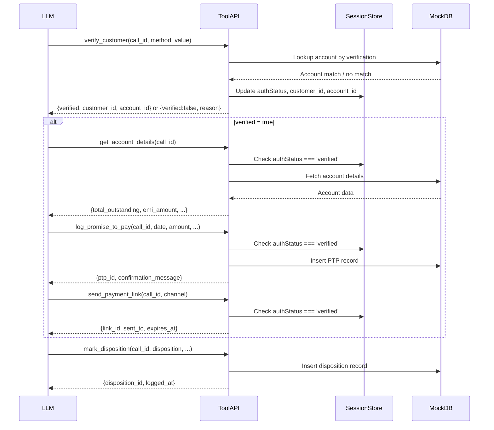

# API Contracts — Maya Collections Voice AI

**Source of Truth**: This document defines the canonical tool contracts. All implementations (mock backend, Vapi config, tests) must conform to these schemas.

---

## Common Types

```typescript
type CallId = string & { readonly __brand: 'CallId' };
type CustomerId = string & { readonly __brand: 'CustomerId' };
type AccountId = string & { readonly __brand: 'AccountId' };
type PTPId = string & { readonly __brand: 'PTPId' };
type DispositionId = string & { readonly __brand: 'DispositionId' };
type EscalationId = string & { readonly __brand: 'EscalationId' };
type LinkId = string & { readonly __brand: 'LinkId' };

type ISODate = string; // YYYY-MM-DD
type ISODateTime = string; // YYYY-MM-DDTHH:mm:ss.sssZ
type PhoneNumber = string; // E.164 format
type INRAmount = number; // Indian Rupees, 2 decimal places max
```

## Vapi Webhook Integration

The Express backend exposes a `/vapi/webhook` adapter endpoint that conforms to Vapi's official custom tools protocol.

### Incoming Vapi Webhook Payload
Vapi sends an HTTP POST with `type: "tool-calls"`. The adapter extracts `message.call.id` and maps it to `call_id` internally, avoiding LLM prompt generation of `call_id`.

```json
{
  "message": {
    "type": "tool-calls",
    "toolCalls": [
      {
        "id": "tc_123",
        "type": "function",
        "function": {
          "name": "verify_customer",
          "arguments": {
            "verification_method": "dob",
            "verification_value": "15081990"
          }
        }
      }
    ],
    "call": {
      "id": "call_abc123"
    }
  }
}
```

### Vapi Webhook Response Format
The webhook adapter responds with the execution result mapped to the `toolCallId`.

```json
{
  "results": [
    {
      "toolCallId": "tc_123",
      "result": {
        "verified": true,
        "customer_id": "cust_789"
      }
    }
  ]
}
```

### Security
Vapi requests are authenticated using the `x-vapi-secret` HTTP header.

---

## 1. verify_customer

### Purpose
Authenticate the customer before any debt information is disclosed. This is the **only** tool that can transition the session from `AUTH_PENDING` to `AUTHENTICATED`.

### Endpoint
`POST /tools/verify_customer`

### Request
```json
{
  "call_id": "call_abc123",
  "verification_method": "dob",
  "verification_value": "15081990"
}
```

| Field | Type | Required | Description |
|-------|------|----------|-------------|
| `call_id` | `CallId` | Yes | Unique call identifier from Vapi |
| `verification_method` | `enum` | Yes | One of: `dob`, `otp`, `last4_phone`, `last4_loan` |
| `verification_value` | `string` | Yes | The value provided by customer (DOB as DDMMYYYY, 4-digit OTP, last 4 digits) |

### Response (Success — 200)
```json
{
  "verified": true,
  "customer_id": "cust_789",
  "account_id": "acc_456",
  "account_status": "active"
}
```

| Field | Type | Description |
|-------|------|-------------|
| `verified` | `true` | Authentication successful |
| `customer_id` | `CustomerId` | Internal customer identifier |
| `account_id` | `AccountId` | Internal account identifier |
| `account_status` | `enum` | `active`, `closed`, or `written_off` |

### Response (Failure — 200)
```json
{
  "verified": false,
  "reason": "invalid_dob",
  "attempts_remaining": 2
}
```

| Field | Type | Description |
|-------|------|-------------|
| `verified` | `false` | Authentication failed |
| `reason` | `enum` | `invalid_dob`, `invalid_otp`, `invalid_last4`, `not_found`, `max_attempts` |
| `attempts_remaining` | `number` | Remaining attempts before forced escalation (max 3 total) |

### Error Response (5xx)
```json
{
  "error": "internal_error",
  "message": "Verification service unavailable"
}
```

### Authentication Requirement
**None** — this tool establishes authentication.

### State Machine Effect
- On `verified: true`: Session `authStatus` → `verified`; `customer_id`, `account_id` stored
- On `verified: false`: Session `authAttempts` incremented; if `attempts_remaining === 0`, next transition must be `ESCALATED`

---

## 2. get_account_details

### Purpose
Retrieve full account/debt details **only after successful authentication**.

### Endpoint
`POST /tools/get_account_details`

### Request
```json
{
  "call_id": "call_abc123"
}
```

| Field | Type | Required | Description |
|-------|------|----------|-------------|
| `call_id` | `CallId` | Yes | Must reference a session with `authStatus === 'verified'` |

### Response (Success — 200)
```json
{
  "account_id": "acc_456",
  "customer_name": "Rajesh Kumar",
  "loan_type": "Personal Loan",
  "total_outstanding": 8499.00,
  "emi_amount": 8499.00,
  "due_date": "2024-08-03",
  "days_past_due": 12,
  "last_payment_date": "2024-07-03",
  "last_payment_amount": 8499.00
}
```

| Field | Type | Description |
|-------|------|-------------|
| `account_id` | `AccountId` | |
| `customer_name` | `string` | Full name for verification confirmation |
| `loan_type` | `string` | Product type |
| `total_outstanding` | `INRAmount` | Total overdue including fees |
| `emi_amount` | `INRAmount` | Regular EMI amount |
| `due_date` | `ISODate` | Original due date of oldest unpaid EMI |
| `days_past_due` | `number` | Calendar days since due date |
| `last_payment_date` | `ISODate \| null` | |
| `last_payment_amount` | `INRAmount \| null` | |

### Response (Failure — 403)
```json
{
  "error": "not_authenticated",
  "message": "Customer not verified. Call verify_customer first."
}
```

### Response (Failure — 404)
```json
{
  "error": "account_not_found",
  "message": "Account not found for this session"
}
```

### Response (Failure — 5xx)
```json
{
  "error": "internal_error",
  "message": "Database unavailable"
}
```

### Authentication Requirement
**MANDATORY** — Middleware must verify `session.authStatus === 'verified'` before allowing access. Returns 403 if not authenticated.

---

## 3. log_promise_to_pay

### Purpose
Record a customer's Promise-to-Pay commitment.

### Endpoint
`POST /tools/log_promise_to_pay`

### Request
```json
{
  "call_id": "call_abc123",
  "ptp_date": "2024-08-20",
  "ptp_amount": 8499.00,
  "payment_method": "upi",
  "notes": "Customer will pay via PhonePe"
}
```

| Field | Type | Required | Validation |
|-------|------|----------|------------|
| `call_id` | `CallId` | Yes | Authenticated session |
| `ptp_date` | `ISODate` | Yes | ≥ today, ≤ today + 30 days |
| `ptp_amount` | `INRAmount` | Yes | > 0, ≤ total_outstanding |
| `payment_method` | `string` | No | `upi`, `netbanking`, `card`, `cash`, `other` |
| `notes` | `string` | No | Max 500 chars |

### Response (Success — 200)
```json
{
  "ptp_id": "ptp_789",
  "status": "recorded",
  "confirmation_message": "Your promise to pay ₹8,499 by 20th August has been recorded. You will receive a confirmation SMS."
}
```

| Field | Type | Description |
|-------|------|-------------|
| `ptp_id` | `PTPId` | Unique PTP record identifier |
| `status` | `string` | Always `recorded` on success |
| `confirmation_message` | `string` | Message for agent to read to customer |

### Response (Failure — 400)
```json
{
  "error": "invalid_date",
  "message": "PTP date must be within 30 days"
}
```

### Response (Failure — 403)
```json
{
  "error": "not_authenticated",
  "message": "Customer not verified"
}
```

### Authentication Requirement
**MANDATORY** — Requires `authStatus === 'verified'`.

---

## 4. send_payment_link

### Purpose
Send a payment link via SMS or WhatsApp (mocked — logs only).

### Endpoint
`POST /tools/send_payment_link`

### Request
```json
{
  "call_id": "call_abc123",
  "channel": "sms",
  "amount": 8499.00
}
```

| Field | Type | Required | Validation |
|-------|------|----------|------------|
| `call_id` | `CallId` | Yes | Authenticated session |
| `channel` | `enum` | Yes | `sms` or `whatsapp` |
| `amount` | `INRAmount` | No | Defaults to `total_outstanding`; > 0 |

### Response (Success — 200)
```json
{
  "link_id": "link_123",
  "channel": "sms",
  "sent_to": "+91 9XXXX XXXX",
  "expires_at": "2024-08-22T23:59:59.000Z"
}
```

| Field | Type | Description |
|-------|------|-------------|
| `link_id` | `LinkId` | Unique link identifier |
| `channel` | `string` | `sms` or `whatsapp` |
| `sent_to` | `string` | Masked phone number (last 4 visible) |
| `expires_at` | `ISODateTime` | Link expiry (48 hours from now) |

### Response (Failure — 403)
```json
{
  "error": "not_authenticated",
  "message": "Customer not verified"
}
```

### Response (Failure — 400)
```json
{
  "error": "channel_unavailable",
  "message": "WhatsApp not configured for this account"
}
```

### Authentication Requirement
**MANDATORY** — Requires `authStatus === 'verified'`.

---

## 5. escalate_to_agent

### Purpose
Transfer call to human agent with full context.

### Endpoint
`POST /tools/escalate_to_agent`

### Request
```json
{
  "call_id": "call_abc123",
  "reason": "dispute",
  "summary": "Customer disputes the late fee of ₹500. Claims payment made on 14th Aug but not reflected. Has bank reference UTR123456.",
  "priority": "high"
}
```

| Field | Type | Required | Validation |
|-------|------|----------|------------|
| `call_id` | `CallId` | Yes | Any session state |
| `reason` | `enum` | Yes | `dispute`, `hardship`, `hostile`, `auth_failed_max`, `customer_request`, `complex_case` |
| `summary` | `string` | Yes | 50–1000 chars; context for agent |
| `priority` | `enum` | No | `normal`, `high`, `urgent` (default: `normal`) |

### Response (Success — 200)
```json
{
  "escalation_id": "esc_456",
  "agent_assigned": "agent_smith",
  "estimated_wait_time": 45
}
```

| Field | Type | Description |
|-------|------|-------------|
| `escalation_id` | `EscalationId` | Unique escalation identifier |
| `agent_assigned` | `string \| null` | Agent name if immediately assigned |
| `estimated_wait_time` | `number` | Seconds until agent pickup |

### Response (Failure — 503)
```json
{
  "error": "no_agents_available",
  "message": "All agents busy. Customer will receive callback."
}
```

### Authentication Requirement
**NONE** — Can be called from any state.

---

## 6. mark_disposition

### Purpose
Log final call outcome for reporting and analytics.

### Endpoint
`POST /tools/mark_disposition`

### Request
```json
{
  "call_id": "call_abc123",
  "disposition": "promise_to_pay",
  "details": "PTP: ₹10,000 by 2024-08-20 via UPI. Payment link sent via SMS.",
  "ptp_id": "ptp_789",
  "escalation_id": null
}
```

| Field | Type | Required | Validation |
|-------|------|----------|------------|
| `call_id` | `CallId` | Yes | |
| `disposition` | `enum` | Yes | See disposition values below |
| `details` | `string` | No | Max 1000 chars; free-text summary |
| `ptp_id` | `PTPId` | No | Required if disposition = `promise_to_pay` |
| `escalation_id` | `EscalationId` | No | Required if disposition = `escalated` |

### Disposition Values
| Value | Description |
|-------|-------------|
| `promise_to_pay` | Customer committed to payment |
| `already_paid` | Payment verified as already made |
| `disputed` | Customer disputes amount/validity |
| `hardship` | Customer claims inability to pay |
| `wrong_person` | Not the account holder |
| `do_not_call` | Requested no further contact |
| `callback_scheduled` | Customer requested callback |
| `auth_failed_max_retries` | 3 failed verification attempts |
| `hostile` | Abusive/threatening behavior |
| `no_response` | Silence, unintelligible, hangup |
| `voicemail` | Reached voicemail |
| `escalated` | Transferred to human agent |
| `other` | Catch-all |

### Response (Success — 200)
```json
{
  "disposition_id": "disp_789",
  "logged_at": "2024-08-15T14:30:00.000Z"
}
```

| Field | Type | Description |
|-------|------|-------------|
| `disposition_id` | `DispositionId` | Unique disposition record |
| `logged_at` | `ISODateTime` | Timestamp of logging |

### Authentication Requirement
**NONE** — Terminal call logging.

---

## Tool Invocation Flow (Sequence)

